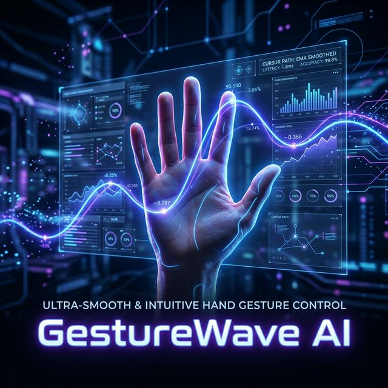

# GestureWave AI 🖐️

### Touch-Free Gesture Control System

**GestureWave AI v2.1** is a real-time, touch-free hand gesture recognition engine that maps your hand movements to your PC cursor and actions using computer vision—no extra hardware required.

## Key Features
- **Premium GUI Dashboard**: Full settings menu to control smoothing, dead zones, click sensitivity, and live event logs smoothly wrapped in a Dark Mode Tkinter UI.
- **8 Native Gestures**: 
  - ☝️ **Move cursor**
  - 🤏 **Left click**
  - 🤌 **Right click**
  - ⚡ **Double click**
  - 🤏→ **Drag and Drop**
  - ✌️ **Scroll up/down**
  - 🔍 **Zoom in/out**
  - ✋ **Pause tracking**
- **Custom App Shortcuts**: Press `R` in front of your camera to record custom hand poses. (Currently, `Gesture_1` automatically launches LinkedIn!)
- **Windows Installer**: One-click `.exe` builder via GitHub actions, entirely deployable. 
- **Next.js Frontend**: Included documentation, feature showcase, and community routing inside the `/frontend-app/` directory.

## Tech Stack
- **AI/Vision**: Python, MediaPipe, OpenCV, NumPy
- **Desktop Control**: PyAutoGUI, Tkinter
- **Continuous Integration**: GitHub Actions, PyInstaller, Inno Setup (ISCC)
- **Frontend App**: Next.js, React, Tailwind CSS, Framer Motion

## Installation & Usage

**Method 1: Desktop Installer (Easiest)**
1. Check the GitHub Actions artifacts or your repository releases.
2. Download `GestureWaveAI_Installer.exe` and follow the standard Windows setup wizard.
3. Launch directly from your start menu.

**Method 2: Run from Source (For Developers)**
```bash
# Safely restrict NumPy to prevent MediaPipe architecture clashes
pip install "numpy<2" -r requirements.txt

  **Developed by [Aditya Yadav],[Ananya Baghel](https://github.com/Annaa74)**

### Development Testing Flow
Use this flow if you are testing modifications to the recognition engine. It bypasses the launcher completely and prints debug logs directly to the console.
```bash
python main.py
```

---

## 👋 Gesture Reference Guide

### 🟢 Stable Core Gestures
The core gesture loop relies on absolute tracking primitives. These are highly optimized and stable across various lighting conditions.

| Emoji | Intended Action | Physical Hand Shape | Description |
| :--- | :--- | :--- | :--- |
| ☝️ | **Move Cursor** | Index finger only | Cursor mimics the absolute 2D position of your index fingertip. |
| 🤏 | **Left Click** | Thumb + Index pinch | Tap the tips of your thumb and index finger together. |
| 🤌 | **Right Click** | Middle + Thumb pinch | Tap the tips of your middle finger and thumb together. |
| ⚡ | **Double Click**| Quick double pinch | Perform two rapid thumb-index pinches in succession. |
| 🤏→ | **Drag & Drop** | Hold Thumb+Index | Pinch items and keep fingers held to move; release to drop. |
| ✌️ | **Scroll** | Peace sign | Point index/middle up; move hand vertically to scroll. |
| 🔍 | **Zoom** | Two fingers spread | Expand/contract distance between index and middle fingers. |
| ✋ | **Pause/Resume**| Open palm | Completely toggles tracking on or off. |

### ⌨️ Testing & Override Controls
If the tracker window is in focus, the following debug commands are active:
- Press **`R`** to instantly snapshot and record a custom target gesture to the registry.
- Press **`Esc`** to safely execute a shutdown and release the camera hook.

---

## 🛑 Known Limitations

- **Lighting Dependency:** Severe backlighting or ultra-low light can drastically reduce MediaPipe's confidence matrix.
- **Occlusion Errors:** If the thumb is hidden behind the palm (relative to the camera), pinch thresholds may fail to fire.
- **Numpy Versioning:** Requires `numpy < 2.0` due to MediaPipe's internal architecture constraints.

---

## 🔮 Future Scope

- **AI Smoothing (Euro Filter):** Implementation of 1€ filter logic for even smoother, lag-free heavy movement.
- **Multi-Hand Logic:** Supporting two-handed chorded shortcuts (e.g., left hand for modifiers like Ctrl/Shift, right hand for navigation).
- **System Tray Integration:** Ability to run the engine entirely in the background as a Windows Service.
- **Voice-Gesture Fusion:** Integrating voice commands (Whisper AI) to complement hand gestures for a truly multimodal HCI experience.

---

## 🏢 Use Cases

- **Presentation Spaces:** Control digital slideshows naturally while standing significantly away from your laptop.
- **Accessible Workstations:** Interact with standard UIs without requiring physical peripheral grips or fine motor mouse control.
- **Hands-Free Prototyping:** A foundation for integration into smart-mirrors, interactive art, and sterile manufacturing environments.

---

## 📄 License & Usage

Distributed under the MIT License. See `LICENSE` for more information.

<div align="center">
  <i>Control space, not screens. Developed by the GestureWave AI Team.</i>
</div>

---

## 💻 Usage

### Normal Mode (Recommended)
```bash
python app.py
```
1. Sign in with Google OAuth or Email/Password (or try Demo mode)
2. Click **▶ Start Tracking** to begin
3. Use hand gestures to control your desktop
4. Press **ESC** in the camera window or click **■ Stop** to end
5. Adjust settings in the **Settings** tab — changes apply live

### Development Mode
```bash
python main.py
```
Bypasses authentication and launches the tracking engine directly.

> [!WARNING]
> Do not run `app.py` and `main.py` simultaneously — both will try to lock the camera.

---

## ⚙️ Configuration

All parameters are tunable in `core/config.py`:

| Parameter | Default | Description |
|-----------|---------|-------------|
| `SMOOTH_ALPHA` | 0.30 | Cursor smoothing factor (lower = smoother, higher = faster) |
| `DEAD_ZONE` | 2px | Minimum pixel movement to register |
| `CLICK_THRESH` | 30px | Distance threshold for pinch detection |
| `CLICK_COOLDOWN` | 0.30s | Minimum time between consecutive clicks |
| `PINCH_STABLE_FRAMES` | 3 | Frames the pinch must be held before it counts |
| `LEFT_CLICK_FREEZE` | 0.05s | Brief cursor lock after click fires |
| `SCROLL_AMOUNT` | 100 | Scroll wheel amount per gesture |
| `SAFE_TOP_BAR` | 90px | Clicks blocked in this top region |

---

## 🛡️ Safety & Security

### What GestureWave AI CAN Do
- ✅ Move the mouse cursor
- ✅ Left click, right click, double click
- ✅ Scroll up/down
- ✅ Zoom in/out (Ctrl+Plus / Ctrl+Minus)

### What GestureWave AI CANNOT Do
- ❌ Create, delete, or modify files
- ❌ Type text or press arbitrary keys
- ❌ Access system settings
- ❌ Trigger dangerous hotkeys (Alt+F4, Ctrl+W, Ctrl+Delete, Win key, etc.)
- ❌ Execute shell commands
- ❌ Modify the registry or environment variables

The `BLOCKED_HOTKEYS` constant in `core/actions.py` explicitly lists every dangerous key combination that is permanently prohibited.

---

## 🔮 Roadmap

- [ ] **Kalman Filter** — Replace EMA smoothing with Kalman filter for cursor stabilization
- [ ] **Multi-Hand Support** — Two-handed chord gestures for complex shortcuts
- [ ] **Gesture Telemetry** — Log gesture sessions to Supabase for usage analytics
- [ ] **Custom Gesture Registry** — User-defined gestures mapped to custom actions
- [ ] **System Tray Mode** — Run as a background process with tray icon
- [ ] **Cross-Platform** — macOS and Linux camera backend support

---

## 🛑 Known Limitations

- **Lighting Dependency** — Strong backlighting or very low light reduces MediaPipe's detection confidence
- **Occlusion Errors** — If the thumb is hidden behind the palm (from the camera's perspective), pinch detection may fail
- **Single Hand** — Currently tracks only one hand at a time
- **Windows Only** — DirectShow camera backend is Windows-specific (macOS/Linux would need a different backend)

---

## 🏢 Use Cases

| Scenario | How GestureWave AI Helps |
|----------|--------------------------|
| **Presentations** | Control slides naturally from across the room |
| **Accessibility** | Interact with desktop UIs without physical peripherals |
| **Medical/Industrial** | Touchless interfaces in sterile or hazardous environments |
| **Interactive Art** | Foundation for smart mirrors and spatial installations |
| **Research** | Baseline for HCI and spatial computing experiments |

---

## 📦 Tech Stack

| Layer | Technology | Purpose |
|-------|-----------|---------|
| **Vision** | MediaPipe 0.10.5 | Hand landmark detection (21-point model) |
| **Computer Vision** | OpenCV 4.8.1 | Camera capture, frame processing, HUD rendering |
| **System Control** | PyAutoGUI | Mouse/keyboard action execution |
| **Backend** | Supabase (PostgreSQL) | Authentication, user records, session management |
| **UI Framework** | Tkinter | Desktop GUI with dark theme |
| **Math** | NumPy | Vector calculations, distance computation |

---

## 📄 License

Distributed under the **MIT License**. See [`LICENSE`](LICENSE) for more information.

---

<div align="center">

  **GestureWave AI** — Control space, not screens.

  Developed with 💙 by **[Aditya Yadav](https://github.com/Annaa74)**  
  *Based on original architecture concepts by Ayush.*

  [](https://github.com/Annaa74)

</div>
